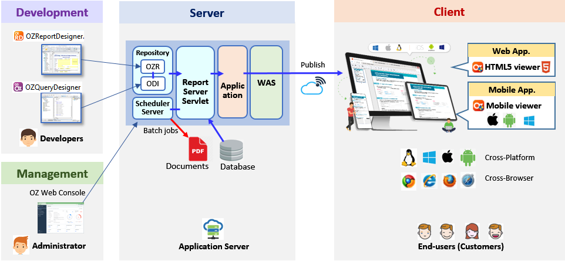

# OZ Report Designer Overview

#### Query Designer

* Create dataset definition from data sources (Database, Web service, etc.)
* Save the result as an ODI file

#### Report Designer

* Import dataset definition from ODI files
* Create reports such as list table, master-detail list, cross-tabulation, and various charts from the dataset definition
* Save the result as an OZR file

#### Service Flow

