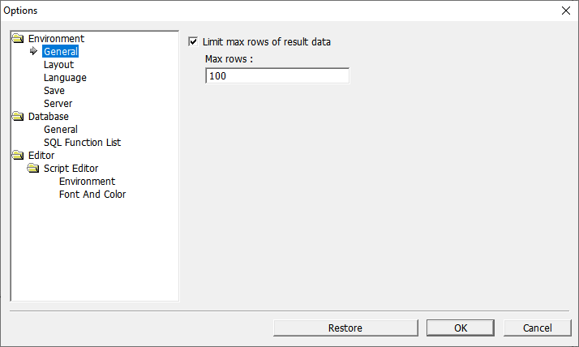

# Entorno de Query Designer

## Interfaz de Usuario de OZ Query Designer

### Menu bar

<table>
  <thead>
    <tr>
      <th style="text-align:left">Item</th>
      <th style="text-align:left">Descripci&#xF3;n</th>
    </tr>
  </thead>
  <tbody>
    <tr>
      <td style="text-align:left">File</td>
      <td style="text-align:left">Men&#xFA;s generales</td>
    </tr>
    <tr>
      <td style="text-align:left">Edit</td>
      <td style="text-align:left">Menus de edici&#xF3;n de Javascript</td>
    </tr>
    <tr>
      <td style="text-align:left">View</td>
      <td style="text-align:left">
        
Data Window

        
Repository Window

        
Properties Window

        
Script Editor Window

        
Script Log Window

      </td>
    </tr>
    <tr>
      <td style="text-align:left">Run</td>
      <td style="text-align:left">Run query</td>
    </tr>
    <tr>
      <td style="text-align:left">Query</td>
      <td style="text-align:left">
        
Design mode

        
Query Wizard

      </td>
    </tr>
    <tr>
      <td style="text-align:left">Window</td>
      <td style="text-align:left">Abrir archivo ODI</td>
    </tr>
    <tr>
      <td style="text-align:left">Help</td>
      <td style="text-align:left">
        
Manual

        
Product version

      </td>
    </tr>
  </tbody>
</table>

#### Opciones

### Menú de Iconos de Acceso Rápido

Iconos de fácil acceso para los comandos más comúnmente usados. 

## Working Folder \(Carpeta de Trabajo\)

#### Working folder

* La carpeta base \(root\) de trabajo que contiene todos los archivos ODI y/o OZR y subcarpetas con estos archivos.
* _**`C:\Users\username\Documents\OZRepository\`**_ es la carpeta de trabajo con la que el programa se inicia por primera vez. Se pueden añadir tantas carpetas de trabajo como se desee.

#### Añadiendo carpetas de trabajo.

1. Acceda al **Working folder manager** \(Repository &gt; Working Folder\)
2. Seleccione la pestaña **Add working folder** situada en la parte superior del Working folder manager.
3. Déle un nombre, seleccione una ruta \(path\), y guarde los cambios.
4. Puede añadir multiples carpetas de trabajo e ir moviendose entre ellas.

#### Definiendo una ruta como carpeta de trabajo temporal.

* Repository &gt; Local Explorer &gt; select your folder &gt; Set Working Folder.

