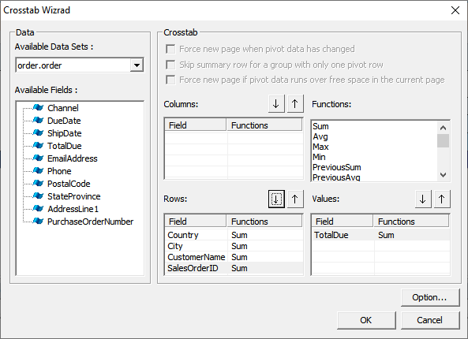
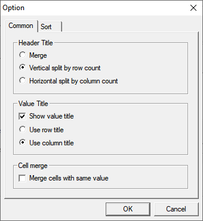
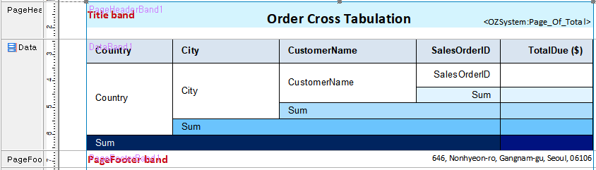
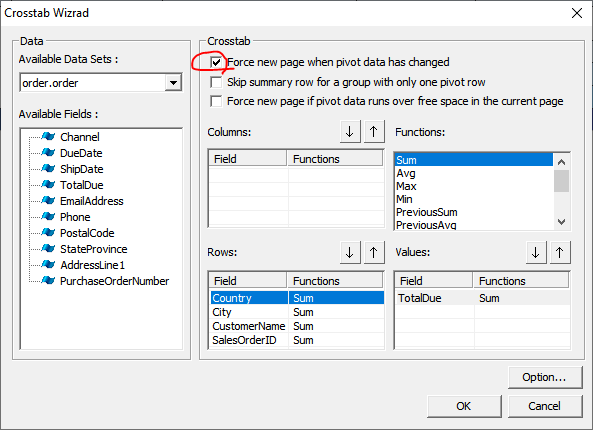

# CrossTab

## Reporte Modelo

[Example](https://oz.ozeform.io/oz/edu/reportdev/order-crosstab.html)

## order-crosstab.ozr 

1. Cree un nuevo ReportTemplate y guardelo como **`order-crosstab.ozr`**.
2. **Inserte el ODI\(D\)** -&gt; **order.odi**
3. Añada una banda de datos \(Data Band\)
4. Añada un **CrossTab** a la banda

## Más opciones

#### CrossTap properties

* FixTitle: True

#### Data band properties

* FixTitle: True

#### CrossTab Options

