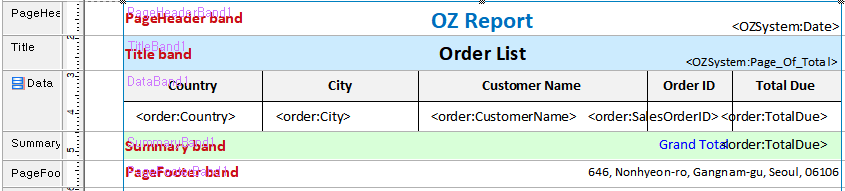
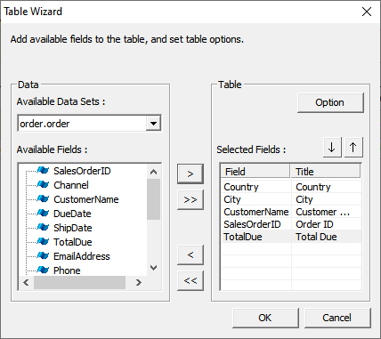
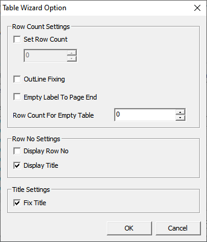
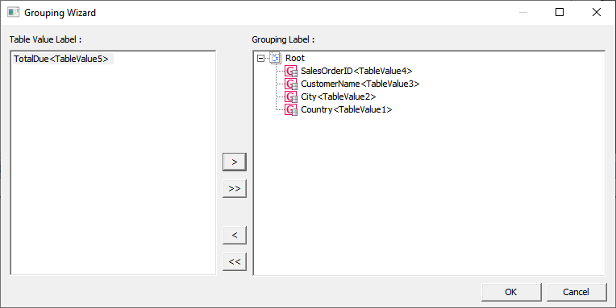

# Table

## Reporte Modelo

[Example](http://oz.ozeform.io/oz/edu/reportdev/order-table.html)

## order-table.ozr

1. Cree un nuevo ReportTemplate y guardelo como **`order-table.ozr`**.
2. **Inserte el archivo ODI\(D\)** -&gt; order.odi
3. Añada las siguientes bandas: PageHeader, Title, Data, Summary, and PageFooter.
4. Añada una **Tabla \(Table\)** en la banda de datos.
5. **Table Wizard** -&gt; seleccione los campos necesarios. 
6. **Table Wizard Option** -&gt; Marque las casillas de Display Title y Fix Title
7. **Grouping Wizard -&gt;** Mueva Country, City, CustomerName, y SalesOrderID del panel izquiero al panel derecho.
8. Añada un componente **Label** in la banda **Summary** y configure las siguientes propiedades:
   1. Data Type: **Summary**
   2. Field Name: **TotalDue**
   3. Summary Type: **Sum**

