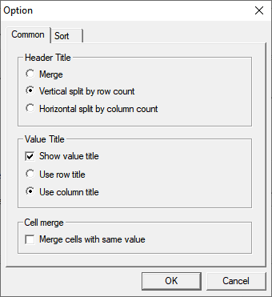
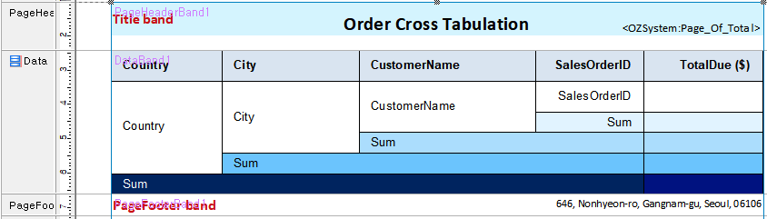
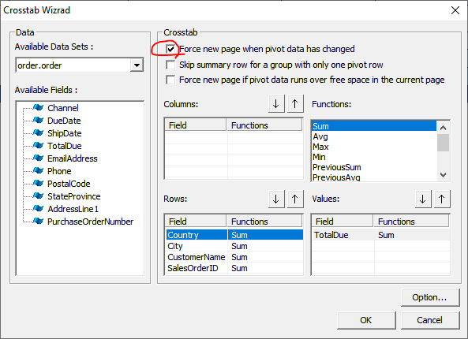

# CrossTab

## Target Report

[Example](http://oz.ozeform.io/oz/edu/reportdev/order-crosstab.html)

## order-crosstab.ozr&#x20;

1. Create a new ReportTemplate and save it as **`order-crosstab.ozr`**.
2. **Insert ODI(D)** -> **order.odi**
3. Add a Data band
4. Add a **CrossTab **to the Data band

## More Settings

#### CrossTap properties

* FixTitle: True

#### Data band properties

* FixTitle: True

#### CrossTab Options

