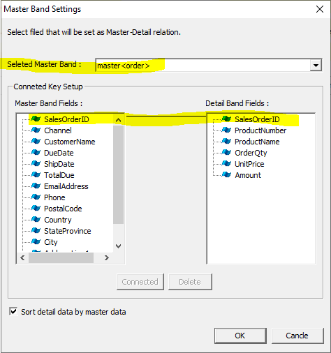

# Master-Detail

## Target Report

[Example](http://oz.ozeform.io/oz/edu/reportdev/order-detail.html)

## order-detail.ozr

Create a new ReportTemplate and save it as **`order-detail.ozr`**.

#### Add Data band for master

1. Add a Data band named **master**.
2. Add a FixedTable (4 by 7)
3. Data row height = 0.7cm, line spacing = 0.2cm
4. Lines for Address and Due date: use **Cell Merge** and **Cell Divide**
5. Put field titles.
6. Assign dataset field values from the dataset **order**.

.png>)

#### Add Data band for detail

1. Add a Data band named **detail** below the **order **band.
2. Add a Table component as illustrated below.

.png>)

Master Band settings

1. Right-click the **detail **data band to open the **Master Band Settings** dialog.
2. Select **master\<order>** as Master band.
3. Select the SalesOrderID and click the **Connected **button (or connect by dragging).
4. Tick the **Sort detail data by master data**

#### Setting options for detail band

1. Set the **Force New Page** property to **True**.
2. Set the **Fix Master **property to **True**.
3. Set the **Fix Title **property to **True**.
