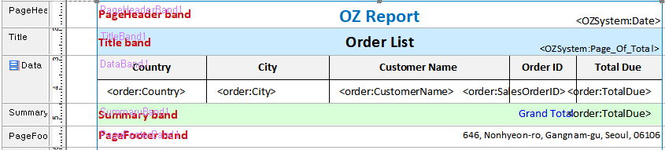
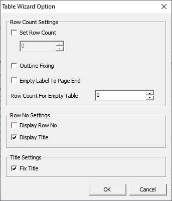

# Table

## Target Report

[Example](http://oz.ozeform.io/oz/edu/reportdev/order-table.html)

## order-table.ozr

1. Create a new ReportTemplate and save it as **`order-table.ozr`**.
2. **Insert ODI(D)** -> order.odi
3. Add PageHeader, Title, Data, Summary, and PageFooter band.
4. Add a **Table **component on the Data** **band
5. **Table Wizard** -> select fields
6. **Table Wizard Option** -> tick the Display Title, Fix Title
7. **Grouping Wizard ->** move Country, City, CustomerName, SalesOrderID from the left to the right pane.
8. Add a **Label **in the **Summary **band and set its
   1. Data Type to **Summary**
   2. Field Name to **TotalDue**
   3. Summary Type to **Sum**

